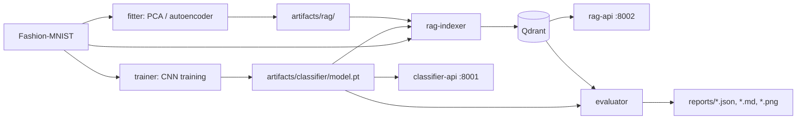

# Fashion-MNIST Classifier Comparison

This project compares two CPU-friendly systems on `zalandoresearch/fashion-mnist`:

1. A compact PyTorch CNN image classifier.
2. A retrieval-augmented classifier that predicts by embedding an image, retrieving similar train examples from Qdrant, and voting over neighbor labels.

Here, RAG means retrieval-augmented classification: there is no LLM in the decision path. The retrieved examples augment the classifier decision by nearest-neighbor evidence.



## Embedding Modes

The project supports 11 embedding modes organized in three groups. Each mode defines how an image is converted to a vector for nearest-neighbor search in Qdrant.

### Preprocessing-only (no training required)

| Mode | Description | Dim |
|---|---|---|
| `raw784` | Pixels to [0,1], flatten, L2-norm. Baseline. | 784 |
| `blur784` | Gaussian blur (sigma=1.0), then same as raw784. | 784 |
| `hog` | HOG features (9 orientations, 7x7 cells), L2-norm. | 36 |
| `hog_blur` | Gaussian blur, then HOG. | 36 |

### Unsupervised (requires fit on training data, no labels used)

| Mode | Description | Dim |
|---|---|---|
| `pca64` | PCA fit on train pixels, transform, L2-norm. | 64 |
| `pca128` | Same, 128 components. | 128 |
| `pca256` | Same, 256 components. | 256 |
| `autoencoder64` | Convolutional autoencoder bottleneck, L2-norm. | 64 |
| `autoencoder128` | Same, 128-dim bottleneck. | 128 |
| `autoencoder256` | Same, 256-dim bottleneck. | 256 |

### CNN-dependent

| Mode | Description | Dim |
|---|---|---|
| `cnn_embedding` | Penultimate layer of trained FashionCNN. | 128 |

All modes are registered in a unified registry (`fashion_compare.models.registry`). Adding a new mode requires implementing an embed function and calling `register()`.

## Quick Start With Docker

```bash
docker compose build
docker compose up -d qdrant

# 1. Train the CNN classifier
docker compose run --rm trainer

# 2. Fit unsupervised models (PCA + autoencoder)
make fit-all

# 3. Index all modes into Qdrant
make index-all

# 4. Start APIs
docker compose up -d classifier-api rag-api

# 5. Evaluate all modes x all top_k values (66 combinations)
make evaluate-all
```

Useful shortcuts:

```bash
make build             # build Docker images
make train             # train CNN
make fit-pca           # fit PCA modes only
make fit-autoencoder   # fit autoencoder modes only
make fit-all           # fit all unsupervised modes
make index-rag         # index raw784 only
make index-rag-cnn     # index cnn_embedding only
make index-mode MODE=hog  # index a single mode
make index-all         # index all 11 modes
make api               # start classifier-api + rag-api
make evaluate          # evaluate with default top_k
make evaluate-all      # evaluate all modes x all top_k candidates
make test              # run pytest
make clean             # remove all artifacts and reports
```

## Local Python

```bash
python -m venv .venv
source .venv/bin/activate
pip install -e ".[dev]"

# Train CNN
python -m fashion_compare.classifier.train

# Fit unsupervised models
python -m fashion_compare.rag.fit                    # fit all (PCA + autoencoder)
python -m fashion_compare.rag.fit --mode pca128      # fit a single mode

# Index into Qdrant
python -m fashion_compare.rag.index --mode raw784
python -m fashion_compare.rag.index --mode hog
python -m fashion_compare.rag.index --mode pca128
python -m fashion_compare.rag.index --mode cnn_embedding

# Evaluate
python -m fashion_compare.evaluation.compare --limit 1000 --top-k 7
python -m fashion_compare.evaluation.compare --tune-top-k              # sweep all top_k candidates
python -m fashion_compare.evaluation.compare --embedding-mode hog --tune-top-k

pytest -q
```

For local Qdrant without Compose:

```bash
docker compose up -d qdrant
export QDRANT_HOST=localhost
```

## APIs

Start services:

```bash
docker compose up -d classifier-api rag-api
```

Health:

```bash
curl http://localhost:8001/health
curl http://localhost:8002/health
```

Multipart image prediction:

```bash
curl -X POST http://localhost:8001/predict -F "image=@sample.png"
curl -X POST "http://localhost:8002/predict?mode=hog&top_k=11" -F "image=@sample.png"
```

JSON pixel-array prediction:

```bash
curl -X POST http://localhost:8001/predict \
  -H "Content-Type: application/json" \
  -d '{"pixels": [[0,0,0,0,0,0,0,0,0,0,0,0,0,0,0,0,0,0,0,0,0,0,0,0,0,0,0,0]]}'
```

Use a full `28x28` array for real predictions. JSON base64 is also accepted with `{"image_base64": "..."}`.

The RAG API accepts any registered mode via the `mode` query parameter.

## CLI Outputs

Training saves:

- `artifacts/classifier/model.pt`
- `artifacts/classifier/metadata.json`

Fitting saves:

- `artifacts/rag/pca64/pca_model.pkl`
- `artifacts/rag/pca128/pca_model.pkl`
- `artifacts/rag/pca256/pca_model.pkl`
- `artifacts/rag/autoencoder64/autoencoder.pt` + `metadata.json`
- `artifacts/rag/autoencoder128/autoencoder.pt` + `metadata.json`
- `artifacts/rag/autoencoder256/autoencoder.pt` + `metadata.json`

Evaluation saves:

- `reports/classifier_metrics.json`
- `reports/rag_{mode}_k{k}_metrics.json` (one per mode x top_k combination)
- `reports/comparison.md`
- `reports/comparison.json`
- `reports/*_confusion_matrix.png`

Metrics include accuracy, macro precision, macro recall, macro F1, per-class precision/recall/F1, confusion matrix, average latency, p50 latency, and p95 latency.

## Evaluation Results

The full evaluation in `reports/` was run on the official Fashion-MNIST test split with `10000` samples. The CNN was trained on `54000` training samples, `6000` samples were used for validation, and all RAG collections were indexed from the same `54000` training samples only. The test split is not used for training or retrieval indexing.

Experiment families:

- `classifier`: direct compact CNN inference, without retrieval.
- `raw784`: nearest-neighbor retrieval over normalized 784-dimensional raw pixel vectors.
- `blur784`: nearest-neighbor retrieval over blurred 784-dimensional pixel vectors.
- `pca64`, `pca128`, `pca256`: retrieval over PCA-compressed image vectors with 64, 128, or 256 dimensions.
- `autoencoder64`, `autoencoder128`, `autoencoder256`: retrieval over autoencoder latent vectors with 64, 128, or 256 dimensions.
- `hog`: retrieval over HOG feature vectors.
- `hog_blur`: retrieval over HOG feature vectors extracted after blur preprocessing.
- `cnn_embedding`: retrieval over the trained CNN's 128-dimensional penultimate representation.

Best result per family:

| Family | Best run | Top K | Accuracy | Macro F1 | Avg latency | P50 latency | P95 latency |
|---|---|---:|---:|---:|---:|---:|---:|
| CNN classifier | `classifier` | - | `0.9194` | `0.9191` | `1.65 ms` | `0.58 ms` | `5.70 ms` |
| cnn_embedding | `rag_cnn_embedding_k11` | `11` | `0.9257` | `0.9253` | `247.84 ms` | `232.26 ms` | `369.48 ms` |
| autoencoder256 | `rag_autoencoder256_k3` | `3` | `0.8863` | `0.8863` | `187.18 ms` | `151.86 ms` | `394.92 ms` |
| autoencoder128 | `rag_autoencoder128_k5` | `5` | `0.8861` | `0.8859` | `197.51 ms` | `152.86 ms` | `472.74 ms` |
| autoencoder64 | `rag_autoencoder64_k5` | `5` | `0.8816` | `0.8815` | `94.57 ms` | `69.94 ms` | `231.56 ms` |
| pca256 | `rag_pca256_k3` | `3` | `0.8690` | `0.8687` | `41.97 ms` | `29.35 ms` | `123.75 ms` |
| pca128 | `rag_pca128_k3` | `3` | `0.8673` | `0.8672` | `38.14 ms` | `28.26 ms` | `115.03 ms` |
| blur784 | `rag_blur784_k3` | `3` | `0.8629` | `0.8624` | `110.91 ms` | `80.56 ms` | `294.41 ms` |
| pca64 | `rag_pca64_k5` | `5` | `0.8628` | `0.8621` | `37.88 ms` | `27.62 ms` | `118.10 ms` |
| raw784 | `rag_raw784_k5` | `5` | `0.8566` | `0.8551` | `40.83 ms` | `29.24 ms` | `121.83 ms` |
| hog_blur | `rag_hog_blur_k7` | `7` | `0.8509` | `0.8504` | `41.83 ms` | `30.82 ms` | `120.49 ms` |
| hog | `rag_hog_k11` | `11` | `0.7995` | `0.7991` | `41.30 ms` | `30.31 ms` | `121.52 ms` |

Full sweep results:

| System | Top K | Samples | Accuracy | Macro F1 | Avg ms | P50 ms | P95 ms |
|---|---|---:|---:|---:|---:|---:|---:|
| classifier | - | 10000 | 0.9194 | 0.9191 | 1.65 | 0.58 | 5.70 |
| rag_autoencoder128_k3 | 3 | 10000 | 0.8855 | 0.8856 | 117.35 | 90.73 | 280.14 |
| rag_autoencoder128_k5 | 5 | 10000 | 0.8861 | 0.8859 | 197.51 | 152.86 | 472.74 |
| rag_autoencoder128_k7 | 7 | 10000 | 0.8853 | 0.8849 | 192.92 | 149.42 | 472.17 |
| rag_autoencoder128_k11 | 11 | 10000 | 0.8831 | 0.8824 | 150.73 | 113.44 | 368.12 |
| rag_autoencoder128_k15 | 15 | 10000 | 0.8830 | 0.8822 | 152.58 | 121.04 | 341.67 |
| rag_autoencoder128_k21 | 21 | 10000 | 0.8774 | 0.8765 | 142.69 | 115.59 | 330.95 |
| rag_autoencoder256_k3 | 3 | 10000 | 0.8863 | 0.8863 | 187.18 | 151.86 | 394.92 |
| rag_autoencoder256_k5 | 5 | 10000 | 0.8843 | 0.8840 | 151.59 | 114.87 | 376.28 |
| rag_autoencoder256_k7 | 7 | 10000 | 0.8845 | 0.8841 | 121.00 | 92.29 | 282.13 |
| rag_autoencoder256_k11 | 11 | 10000 | 0.8833 | 0.8828 | 117.30 | 92.02 | 265.98 |
| rag_autoencoder256_k15 | 15 | 10000 | 0.8814 | 0.8807 | 120.19 | 94.73 | 272.84 |
| rag_autoencoder256_k21 | 21 | 10000 | 0.8793 | 0.8784 | 99.31 | 69.62 | 243.00 |
| rag_autoencoder64_k3 | 3 | 10000 | 0.8794 | 0.8796 | 114.82 | 91.49 | 270.37 |
| rag_autoencoder64_k5 | 5 | 10000 | 0.8816 | 0.8815 | 94.57 | 69.94 | 231.56 |
| rag_autoencoder64_k7 | 7 | 10000 | 0.8792 | 0.8789 | 92.57 | 64.89 | 232.83 |
| rag_autoencoder64_k11 | 11 | 10000 | 0.8774 | 0.8769 | 94.84 | 69.27 | 230.28 |
| rag_autoencoder64_k15 | 15 | 10000 | 0.8754 | 0.8746 | 88.22 | 62.14 | 214.25 |
| rag_autoencoder64_k21 | 21 | 10000 | 0.8721 | 0.8712 | 107.40 | 78.67 | 258.30 |
| rag_blur784_k3 | 3 | 10000 | 0.8629 | 0.8624 | 110.91 | 80.56 | 294.41 |
| rag_blur784_k5 | 5 | 10000 | 0.8595 | 0.8586 | 49.68 | 31.76 | 147.51 |
| rag_blur784_k7 | 7 | 10000 | 0.8614 | 0.8603 | 51.35 | 31.54 | 147.96 |
| rag_blur784_k11 | 11 | 10000 | 0.8562 | 0.8548 | 41.85 | 29.57 | 122.12 |
| rag_blur784_k15 | 15 | 10000 | 0.8519 | 0.8502 | 42.46 | 30.13 | 125.77 |
| rag_blur784_k21 | 21 | 10000 | 0.8477 | 0.8456 | 42.45 | 30.24 | 124.98 |
| rag_cnn_embedding_k3 | 3 | 10000 | 0.9202 | 0.9199 | 234.27 | 213.67 | 337.95 |
| rag_cnn_embedding_k5 | 5 | 10000 | 0.9235 | 0.9231 | 240.76 | 220.59 | 343.99 |
| rag_cnn_embedding_k7 | 7 | 10000 | 0.9249 | 0.9245 | 240.53 | 223.82 | 349.55 |
| rag_cnn_embedding_k11 | 11 | 10000 | 0.9257 | 0.9253 | 247.84 | 232.26 | 369.48 |
| rag_cnn_embedding_k15 | 15 | 10000 | 0.9255 | 0.9250 | 242.45 | 220.65 | 363.68 |
| rag_cnn_embedding_k21 | 21 | 10000 | 0.9244 | 0.9239 | 239.31 | 218.81 | 341.52 |
| rag_hog_k3 | 3 | 10000 | 0.7886 | 0.7887 | 39.99 | 30.07 | 117.68 |
| rag_hog_k5 | 5 | 10000 | 0.7984 | 0.7983 | 41.13 | 30.71 | 118.07 |
| rag_hog_k7 | 7 | 10000 | 0.7980 | 0.7978 | 40.11 | 30.05 | 118.51 |
| rag_hog_k11 | 11 | 10000 | 0.7995 | 0.7991 | 41.30 | 30.31 | 121.52 |
| rag_hog_k15 | 15 | 10000 | 0.7993 | 0.7988 | 41.92 | 30.94 | 120.85 |
| rag_hog_k21 | 21 | 10000 | 0.7981 | 0.7975 | 100.74 | 52.24 | 327.86 |
| rag_hog_blur_k3 | 3 | 10000 | 0.8409 | 0.8406 | 42.98 | 31.51 | 123.61 |
| rag_hog_blur_k5 | 5 | 10000 | 0.8478 | 0.8473 | 41.62 | 30.50 | 119.78 |
| rag_hog_blur_k7 | 7 | 10000 | 0.8509 | 0.8504 | 41.83 | 30.82 | 120.49 |
| rag_hog_blur_k11 | 11 | 10000 | 0.8506 | 0.8503 | 42.79 | 31.05 | 122.97 |
| rag_hog_blur_k15 | 15 | 10000 | 0.8489 | 0.8485 | 42.22 | 31.55 | 120.72 |
| rag_hog_blur_k21 | 21 | 10000 | 0.8474 | 0.8471 | 40.77 | 30.98 | 117.28 |
| rag_pca128_k3 | 3 | 10000 | 0.8673 | 0.8672 | 38.14 | 28.26 | 115.03 |
| rag_pca128_k5 | 5 | 10000 | 0.8662 | 0.8655 | 38.70 | 28.12 | 115.64 |
| rag_pca128_k7 | 7 | 10000 | 0.8636 | 0.8626 | 41.60 | 28.92 | 123.48 |
| rag_pca128_k11 | 11 | 10000 | 0.8640 | 0.8629 | 39.34 | 28.47 | 118.06 |
| rag_pca128_k15 | 15 | 10000 | 0.8601 | 0.8590 | 38.57 | 28.02 | 116.28 |
| rag_pca128_k21 | 21 | 10000 | 0.8581 | 0.8566 | 39.96 | 28.66 | 119.42 |
| rag_pca256_k3 | 3 | 10000 | 0.8690 | 0.8687 | 41.97 | 29.35 | 123.75 |
| rag_pca256_k5 | 5 | 10000 | 0.8644 | 0.8639 | 40.34 | 28.61 | 121.19 |
| rag_pca256_k7 | 7 | 10000 | 0.8656 | 0.8647 | 42.48 | 29.51 | 123.14 |
| rag_pca256_k11 | 11 | 10000 | 0.8623 | 0.8613 | 40.57 | 29.61 | 120.58 |
| rag_pca256_k15 | 15 | 10000 | 0.8596 | 0.8584 | 42.00 | 29.36 | 125.47 |
| rag_pca256_k21 | 21 | 10000 | 0.8561 | 0.8545 | 42.17 | 29.34 | 124.45 |
| rag_pca64_k3 | 3 | 10000 | 0.8606 | 0.8601 | 38.33 | 28.00 | 116.70 |
| rag_pca64_k5 | 5 | 10000 | 0.8628 | 0.8621 | 37.88 | 27.62 | 118.10 |
| rag_pca64_k7 | 7 | 10000 | 0.8609 | 0.8600 | 35.99 | 27.26 | 112.19 |
| rag_pca64_k11 | 11 | 10000 | 0.8600 | 0.8588 | 37.49 | 27.78 | 114.07 |
| rag_pca64_k15 | 15 | 10000 | 0.8591 | 0.8581 | 36.56 | 27.62 | 114.14 |
| rag_pca64_k21 | 21 | 10000 | 0.8565 | 0.8552 | 43.91 | 28.75 | 133.48 |
| rag_raw784_k3 | 3 | 10000 | 0.8542 | 0.8533 | 77.01 | 42.87 | 236.55 |
| rag_raw784_k5 | 5 | 10000 | 0.8566 | 0.8551 | 40.83 | 29.24 | 121.83 |
| rag_raw784_k7 | 7 | 10000 | 0.8532 | 0.8511 | 42.42 | 29.95 | 127.95 |
| rag_raw784_k11 | 11 | 10000 | 0.8487 | 0.8459 | 42.93 | 29.79 | 124.38 |
| rag_raw784_k15 | 15 | 10000 | 0.8433 | 0.8403 | 41.11 | 29.47 | 123.59 |
| rag_raw784_k21 | 21 | 10000 | 0.8374 | 0.8336 | 41.86 | 30.01 | 122.59 |

Main conclusions:

- `rag_cnn_embedding_k11` is the best run overall: accuracy `0.9257` and macro F1 `0.9253`, slightly above the direct CNN classifier.
- The direct CNN classifier remains the fastest and strongest non-retrieval baseline: macro F1 `0.9191` with average latency `1.65 ms`.
- The best retrieval family that does not reuse CNN features is `autoencoder256` at `top_k=3`, with macro F1 `0.8863`.
- PCA, raw pixels, blur pixels, and HOG variants are consistently below the CNN baseline; among these, `pca256_k3` is the strongest with macro F1 `0.8687`.
- Larger `top_k` does not always help. Most non-CNN retrieval families peak at `top_k=3` or `top_k=5`, while `cnn_embedding` peaks at `top_k=11`.
- Detailed per-class metrics and confusion matrices are stored in `reports/*_metrics.json` and `reports/*_confusion_matrix.png` for every run.

## Configuration

All important settings are environment variables. See `.env.example`:

- `DATA_DIR`
- `ARTIFACTS_DIR`
- `REPORTS_DIR`
- `QDRANT_HOST`
- `QDRANT_PORT`
- `EPOCHS`
- `BATCH_SIZE`
- `LEARNING_RATE`
- `TOP_K`
- `EMBEDDING_MODE`
- `SEED`
- `AUTOENCODER_EPOCHS` — number of training epochs for autoencoder modes (default: 20)
- `TOP_K_CANDIDATES` — list of top_k values for `--tune-top-k` sweep (default: [3, 5, 7, 11, 15, 21])

## RAG Modes

### Preprocessing-only

- `raw784`: normalize image pixels to `[0, 1]`, flatten to 784 dimensions, L2-normalize, search with cosine distance.
- `blur784`: apply Gaussian blur (sigma=1.0) to reduce pixel-level noise, then same as `raw784`.
- `hog`: extract Histogram of Oriented Gradients features (9 orientations, 7x7 pixel cells) to capture edge/gradient information instead of raw pixels. L2-normalized.
- `hog_blur`: apply Gaussian blur before HOG extraction. Combines noise reduction with gradient features.

### Unsupervised

- `pca64` / `pca128` / `pca256`: fit PCA on training images (unsupervised, no labels), reduce dimensionality from 784 to 64/128/256, L2-normalize. Requires a fit step before indexing.
- `autoencoder64` / `autoencoder128` / `autoencoder256`: train a convolutional autoencoder on training images (unsupervised, MSE reconstruction loss), use the bottleneck layer as embedding. Requires a fit step before indexing.

### CNN-dependent

- `cnn_embedding`: load the trained CNN and use the 128-dimensional penultimate hidden representation, L2-normalized, with cosine distance.

## Limitations

- Raw pixel retrieval is not semantic RAG; it is nearest-neighbor matching in pixel space.
- `cnn_embedding` RAG uses learned features from the classifier, so it is not independent of the CNN.
- Fashion-MNIST is small and artificial compared to real product images.
- LLM generation is intentionally excluded from the core classification decision.
- Unsupervised modes (PCA, autoencoder) require a fit step that loads the entire training set into memory.
