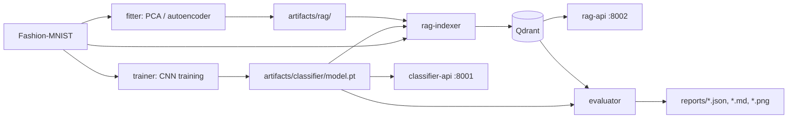

# Fashion-MNIST Classifier Comparison

This project compares two CPU-friendly systems on `zalandoresearch/fashion-mnist`:

1. A compact PyTorch CNN image classifier.
2. A retrieval-augmented classifier that predicts by embedding an image, retrieving similar train examples from Qdrant, and voting over neighbor labels.

Here, RAG means retrieval-augmented classification: there is no LLM in the decision path. The retrieved examples augment the classifier decision by nearest-neighbor evidence.



## Embedding Modes

The project supports 11 embedding modes organized in three groups. Each mode defines how an image is converted to a vector for nearest-neighbor search in Qdrant.

### Preprocessing-only (no training required)

| Mode | Description | Dim |
|---|---|---|
| `raw784` | Pixels to [0,1], flatten, L2-norm. Baseline. | 784 |
| `blur784` | Gaussian blur (sigma=1.0), then same as raw784. | 784 |
| `hog` | HOG features (9 orientations, 7x7 cells), L2-norm. | 36 |
| `hog_blur` | Gaussian blur, then HOG. | 36 |

### Unsupervised (requires fit on training data, no labels used)

| Mode | Description | Dim |
|---|---|---|
| `pca64` | PCA fit on train pixels, transform, L2-norm. | 64 |
| `pca128` | Same, 128 components. | 128 |
| `pca256` | Same, 256 components. | 256 |
| `autoencoder64` | Convolutional autoencoder bottleneck, L2-norm. | 64 |
| `autoencoder128` | Same, 128-dim bottleneck. | 128 |
| `autoencoder256` | Same, 256-dim bottleneck. | 256 |

### CNN-dependent

| Mode | Description | Dim |
|---|---|---|
| `cnn_embedding` | Penultimate layer of trained FashionCNN. | 128 |

All modes are registered in a unified registry (`fashion_compare.models.registry`). Adding a new mode requires implementing an embed function and calling `register()`.

## Quick Start With Docker

```bash
docker compose build
docker compose up -d qdrant

# 1. Train the CNN classifier
docker compose run --rm trainer

# 2. Fit unsupervised models (PCA + autoencoder)
make fit-all

# 3. Index all modes into Qdrant
make index-all

# 4. Start APIs
docker compose up -d classifier-api rag-api

# 5. Evaluate all modes x all top_k values (66 combinations)
make evaluate-all
```

Useful shortcuts:

```bash
make build             # build Docker images
make train             # train CNN
make fit-pca           # fit PCA modes only
make fit-autoencoder   # fit autoencoder modes only
make fit-all           # fit all unsupervised modes
make index-rag         # index raw784 only
make index-rag-cnn     # index cnn_embedding only
make index-mode MODE=hog  # index a single mode
make index-all         # index all 11 modes
make api               # start classifier-api + rag-api
make evaluate          # evaluate with default top_k
make evaluate-all      # evaluate all modes x all top_k candidates
make test              # run pytest
make clean             # remove all artifacts and reports
```

## Local Python

```bash
python -m venv .venv
source .venv/bin/activate
pip install -e ".[dev]"

# Train CNN
python -m fashion_compare.classifier.train

# Fit unsupervised models
python -m fashion_compare.rag.fit                    # fit all (PCA + autoencoder)
python -m fashion_compare.rag.fit --mode pca128      # fit a single mode

# Index into Qdrant
python -m fashion_compare.rag.index --mode raw784
python -m fashion_compare.rag.index --mode hog
python -m fashion_compare.rag.index --mode pca128
python -m fashion_compare.rag.index --mode cnn_embedding

# Evaluate
python -m fashion_compare.evaluation.compare --limit 1000 --top-k 7
python -m fashion_compare.evaluation.compare --tune-top-k              # sweep all top_k candidates
python -m fashion_compare.evaluation.compare --embedding-mode hog --tune-top-k

pytest -q
```

For local Qdrant without Compose:

```bash
docker compose up -d qdrant
export QDRANT_HOST=localhost
```

## APIs

Start services:

```bash
docker compose up -d classifier-api rag-api
```

Health:

```bash
curl http://localhost:8001/health
curl http://localhost:8002/health
```

Multipart image prediction:

```bash
curl -X POST http://localhost:8001/predict -F "image=@sample.png"
curl -X POST "http://localhost:8002/predict?mode=hog&top_k=11" -F "image=@sample.png"
```

JSON pixel-array prediction:

```bash
curl -X POST http://localhost:8001/predict \
  -H "Content-Type: application/json" \
  -d '{"pixels": [[0,0,0,0,0,0,0,0,0,0,0,0,0,0,0,0,0,0,0,0,0,0,0,0,0,0,0,0]]}'
```

Use a full `28x28` array for real predictions. JSON base64 is also accepted with `{"image_base64": "..."}`.

The RAG API accepts any registered mode via the `mode` query parameter.

## CLI Outputs

Training saves:

- `artifacts/classifier/model.pt`
- `artifacts/classifier/metadata.json`

Fitting saves:

- `artifacts/rag/pca64/pca_model.pkl`
- `artifacts/rag/pca128/pca_model.pkl`
- `artifacts/rag/pca256/pca_model.pkl`
- `artifacts/rag/autoencoder64/autoencoder.pt` + `metadata.json`
- `artifacts/rag/autoencoder128/autoencoder.pt` + `metadata.json`
- `artifacts/rag/autoencoder256/autoencoder.pt` + `metadata.json`

Evaluation saves:

- `reports/classifier_metrics.json`
- `reports/rag_{mode}_k{k}_metrics.json` (one per mode x top_k combination)
- `reports/comparison.md`
- `reports/comparison.json`
- `reports/*_confusion_matrix.png`

Metrics include accuracy, macro precision, macro recall, macro F1, per-class precision/recall/F1, confusion matrix, average latency, p50 latency, and p95 latency.

## Evaluation Results

The full evaluation was run on the official Fashion-MNIST test split with `10000` samples. The CNN was trained on `54000` training samples, `6000` samples were used for validation, and both RAG collections were indexed from the same `54000` training samples only. The test split is not used for training or retrieval indexing.

| System | Accuracy | Macro F1 | Avg latency | P50 latency | P95 latency |
|---|---:|---:|---:|---:|---:|
| CNN classifier | `0.9182` | `0.9175` | `0.35 ms` | `0.31 ms` | `0.63 ms` |
| RAG raw784 | `0.8532` | `0.8511` | `19.93 ms` | `18.56 ms` | `24.70 ms` |
| RAG cnn_embedding | `0.9229` | `0.9226` | `43.38 ms` | `40.65 ms` | `55.40 ms` |

Results for the new modes will appear here after running `make evaluate-all`.

Main conclusions:

- The compact CNN is the fastest system by a large margin and already reaches strong Fashion-MNIST quality.
- Raw pixel retrieval is significantly weaker than the CNN because nearest neighbors in pixel space do not reliably capture semantic similarity.
- CNN-embedding retrieval slightly outperformed the standalone CNN on this run, but it is much slower because each prediction performs embedding extraction plus vector search.
- The `cnn_embedding` RAG result is not independent of the CNN: it uses the CNN's learned representation as the retrieval space.

## Configuration

All important settings are environment variables. See `.env.example`:

- `DATA_DIR`
- `ARTIFACTS_DIR`
- `REPORTS_DIR`
- `QDRANT_HOST`
- `QDRANT_PORT`
- `EPOCHS`
- `BATCH_SIZE`
- `LEARNING_RATE`
- `TOP_K`
- `EMBEDDING_MODE`
- `SEED`
- `AUTOENCODER_EPOCHS` — number of training epochs for autoencoder modes (default: 20)
- `TOP_K_CANDIDATES` — list of top_k values for `--tune-top-k` sweep (default: [3, 5, 7, 11, 15, 21])

## RAG Modes

### Preprocessing-only

- `raw784`: normalize image pixels to `[0, 1]`, flatten to 784 dimensions, L2-normalize, search with cosine distance.
- `blur784`: apply Gaussian blur (sigma=1.0) to reduce pixel-level noise, then same as `raw784`.
- `hog`: extract Histogram of Oriented Gradients features (9 orientations, 7x7 pixel cells) to capture edge/gradient information instead of raw pixels. L2-normalized.
- `hog_blur`: apply Gaussian blur before HOG extraction. Combines noise reduction with gradient features.

### Unsupervised

- `pca64` / `pca128` / `pca256`: fit PCA on training images (unsupervised, no labels), reduce dimensionality from 784 to 64/128/256, L2-normalize. Requires a fit step before indexing.
- `autoencoder64` / `autoencoder128` / `autoencoder256`: train a convolutional autoencoder on training images (unsupervised, MSE reconstruction loss), use the bottleneck layer as embedding. Requires a fit step before indexing.

### CNN-dependent

- `cnn_embedding`: load the trained CNN and use the 128-dimensional penultimate hidden representation, L2-normalized, with cosine distance.

## Limitations

- Raw pixel retrieval is not semantic RAG; it is nearest-neighbor matching in pixel space.
- `cnn_embedding` RAG uses learned features from the classifier, so it is not independent of the CNN.
- Fashion-MNIST is small and artificial compared to real product images.
- LLM generation is intentionally excluded from the core classification decision.
- Unsupervised modes (PCA, autoencoder) require a fit step that loads the entire training set into memory.
