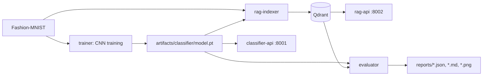

# Fashion-MNIST Classifier Comparison

This project compares two CPU-friendly systems on `zalandoresearch/fashion-mnist`:

1. A compact PyTorch CNN image classifier.
2. A retrieval-augmented classifier that predicts by embedding an image, retrieving similar train examples from Qdrant, and voting over neighbor labels.

Here, RAG means retrieval-augmented classification: there is no LLM in the decision path. The retrieved examples augment the classifier decision by nearest-neighbor evidence.



## Quick Start With Docker

```bash
docker compose build
docker compose up -d qdrant
docker compose run --rm trainer
docker compose run --rm rag-indexer
EMBEDDING_MODE=cnn_embedding docker compose run --rm rag-indexer
docker compose up -d classifier-api rag-api
docker compose run --rm evaluator
```

Useful shortcuts:

```bash
make build
make train
make index-rag
make index-rag-cnn
make api
make evaluate
make test
```

## Local Python

```bash
python -m venv .venv
source .venv/bin/activate
pip install -e ".[dev]"
python -m fashion_compare.classifier.train
python -m fashion_compare.rag.index --mode raw784
python -m fashion_compare.rag.index --mode cnn_embedding
python -m fashion_compare.evaluation.compare --limit 1000 --top-k 7
pytest -q
```

For local Qdrant without Compose:

```bash
docker compose up -d qdrant
export QDRANT_HOST=localhost
```

## APIs

Start services:

```bash
docker compose up -d classifier-api rag-api
```

Health:

```bash
curl http://localhost:8001/health
curl http://localhost:8002/health
```

Multipart image prediction:

```bash
curl -X POST http://localhost:8001/predict -F "image=@sample.png"
curl -X POST "http://localhost:8002/predict?mode=raw784&top_k=7" -F "image=@sample.png"
```

JSON pixel-array prediction:

```bash
curl -X POST http://localhost:8001/predict \
  -H "Content-Type: application/json" \
  -d '{"pixels": [[0,0,0,0,0,0,0,0,0,0,0,0,0,0,0,0,0,0,0,0,0,0,0,0,0,0,0,0]]}'
```

Use a full `28x28` array for real predictions. JSON base64 is also accepted with `{"image_base64": "..."}`.

## CLI Outputs

Training saves:

- `artifacts/classifier/model.pt`
- `artifacts/classifier/metadata.json`

Evaluation saves:

- `reports/classifier_metrics.json`
- `reports/rag_raw784_metrics.json`
- `reports/rag_cnn_embedding_metrics.json`
- `reports/comparison.md`
- `reports/comparison.json`
- `reports/*_confusion_matrix.png`

Metrics include accuracy, macro precision, macro recall, macro F1, per-class precision/recall/F1, confusion matrix, average latency, p50 latency, and p95 latency.

## Evaluation Results

The full evaluation was run on the official Fashion-MNIST test split with `10000` samples. The CNN was trained on `54000` training samples, `6000` samples were used for validation, and both RAG collections were indexed from the same `54000` training samples only. The test split is not used for training or retrieval indexing.

| System | Accuracy | Macro F1 | Avg latency | P50 latency | P95 latency |
|---|---:|---:|---:|---:|---:|
| CNN classifier | `0.9182` | `0.9175` | `0.35 ms` | `0.31 ms` | `0.63 ms` |
| RAG raw784 | `0.8532` | `0.8511` | `19.93 ms` | `18.56 ms` | `24.70 ms` |
| RAG cnn_embedding | `0.9229` | `0.9226` | `43.38 ms` | `40.65 ms` | `55.40 ms` |

Main conclusions:

- The compact CNN is the fastest system by a large margin and already reaches strong Fashion-MNIST quality.
- Raw pixel retrieval is significantly weaker than the CNN because nearest neighbors in pixel space do not reliably capture semantic similarity.
- CNN-embedding retrieval slightly outperformed the standalone CNN on this run, but it is much slower because each prediction performs embedding extraction plus vector search.
- The `cnn_embedding` RAG result is not independent of the CNN: it uses the CNN's learned representation as the retrieval space.

## Configuration

All important settings are environment variables. See `.env.example`:

- `DATA_DIR`
- `ARTIFACTS_DIR`
- `REPORTS_DIR`
- `QDRANT_HOST`
- `QDRANT_PORT`
- `EPOCHS`
- `BATCH_SIZE`
- `LEARNING_RATE`
- `TOP_K`
- `EMBEDDING_MODE`
- `SEED`

## RAG Modes

- `raw784`: normalize image pixels to `[0, 1]`, flatten to 784 dimensions, L2-normalize, search with cosine distance.
- `cnn_embedding`: load the trained CNN and use the 128-dimensional penultimate hidden representation, L2-normalized, with cosine distance.

## Limitations

- Raw pixel retrieval is not semantic RAG; it is nearest-neighbor matching in pixel space.
- `cnn_embedding` RAG uses learned features from the classifier, so it is not independent of the CNN.
- Fashion-MNIST is small and artificial compared to real product images.
- LLM generation is intentionally excluded from the core classification decision.
